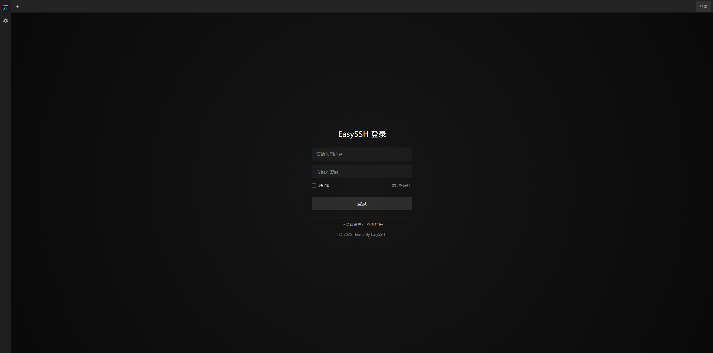

# EasySSH

<div align="center">
  
  <h3>现代化Web终端 · 高效服务器管理 · 安全远程访问</h3>

  <p>
    <a href="#在线演示">在线演示</a> •
    <a href="#核心特性">核心特性</a> •
    <a href="#快速开始">快速开始</a> •
    <a href="#技术实现">技术实现</a> •
    <a href="#部署指南">部署指南</a> •
    <a href="#未来规划">未来规划</a>
  </p>

  <p>
    
    
    
    
    
  </p>

  <p>
    <strong>🌐 多语言支持 | Multi-language Support</strong><br/>
    <a href="docs/zh/README.md">🇨🇳 中文</a> |
    <a href="docs/en/README.md">🇺🇸 English</a> |
    <a href="docs/README.md">📚 文档中心</a>
  </p>
</div>

## 产品介绍

**EasySSH**是一款强大的基于Web的SSH终端客户端，为开发者、系统管理员和DevOps团队提供高效、安全、易用的远程服务器管理体验。无需安装额外软件，只需一个浏览器，即可随时随地管理您的所有服务器。

## 在线演示

- [EasySSH在线体验](https://easyssh.example.com)
- 体验账号: `demo@example.com` / 密码: `admin`

<div align="center">
  
</div>

## 核心特性

<table>
  <tr>
    <td>🌐 <b>浏览器SSH终端</b></td>
    <td>通过任何现代浏览器访问远程服务器，无需安装额外软件</td>
  </tr>
  <tr>
    <td>⚡ <b>高性能架构</b></td>
    <td>采用WebSocket实时通信，确保命令响应迅速，支持上千并发连接</td>
  </tr>
  <tr>
    <td>🔐 <b>安全凭证管理</b></td>
    <td>所有服务器凭证通过军事级AES-256加密存储，保障数据安全</td>
  </tr>
  <tr>
    <td>🔄 <b>会话持久化</b></td>
    <td>支持断线重连和会话恢复，保持工作连续性</td>
  </tr>
  <tr>
    <td>📱 <b>响应式设计</b></td>
    <td>完美适配从手机到大屏显示器的各种屏幕尺寸</td>
  </tr>
  <tr>
    <td>🎨 <b>多主题支持</b></td>
    <td>丰富的终端主题选择，包括深色模式和护眼模式</td>
  </tr>
  <tr>
    <td>📑 <b>多标签管理</b></td>
    <td>在单一界面中并行连接和管理多台服务器</td>
  </tr>
  <tr>
    <td>🚀 <b>混合存储引擎</b></td>
    <td>SQLite + node-cache混合存储架构，平衡性能和可靠性</td>
  </tr>
  <tr>
    <td>🔧 <b>广泛兼容性</b></td>
    <td>支持bash、ash、dash等多种shell，完美兼容OpenWrt/ImmortalWrt等嵌入式系统</td>
  </tr>
  <tr>
    <td>🤖 <b>AI智能助手</b></td>
    <td>集成AI助手功能，支持命令建议、错误分析和智能对话，提升运维效率</td>
  </tr>
</table>

## 使用场景

- **开发团队**: 多人协作管理开发、测试和生产服务器
- **系统管理员**: 集中监控和管理大量服务器
- **DevOps工程师**: 在CI/CD流程中快速执行部署和维护操作
- **远程工作**: 随时随地安全地访问工作环境
- **教育机构**: 为学生提供统一的Linux学习环境

## 快速开始

### 🐳 Docker 快速启动

```bash
# Docker 快速启动
docker run -d \
  --name easyssh \
  --restart unless-stopped \
  -p 8520:8520 \
  -v easyssh-data:/app/server/data \
  -v easyssh-logs:/app/server/logs \
  shanheee/easyssh:latest
```
> **访问方式**：部署完成后，直接通过服务器的 IP 地址访问 `http://<服务器IP>:8520` 即可打开 EasySSH 界面。

### 💻 本地开发安装

```bash
# 克隆仓库
git clone https://github.com/shanheee/easyssh.git
cd easyssh

# 安装依赖
npm install

# 配置环境
cp .env.example .env
# 编辑.env文件设置环境参数

# 启动开发服务器
npm run dev
```

### 使用方法

1. 访问 http://localhost:8520
2. 首次使用：如果系统尚无管理员，登录页面会提示“登录并创建管理员账户”；已有管理员时，直接登录即可
3. 添加您的第一台服务器
4. 点击连接按钮，开始远程管理！

## 技术实现

### 系统架构

```
┌─────────────┐    :8520    ┌─────────────┐    :8000    ┌─────────────────────┐
│   客户端     │◄──────────►│    Nginx    │◄──────────►│   Node.js 后端      │
│ (Vue.js SPA)│             │  (反向代理)  │             │   (Express)         │
└─────────────┘             └─────────────┘             └─────────┬───────────┘
                                   │                              │
                            ┌──────┴──────┐                      │
                            │             │                      │
                      ┌─────▼─────┐ ┌─────▼─────┐               │
                      │  SSH WS   │ │ 监控 WS   │               │
                      │  /ssh     │ │ /monitor  │               │
                      └───────────┘ └───────────┘               │
                                                                 │
                                                       ┌─────────▼─────────┐
                                                       │                   │
                                                 ┌─────▼─────┐       ┌─────▼─────┐
                                                 │  SQLite   │       │监控数据   │
                                                 │(持久化层) │       │缓存层     │
                                                 └───────────┘       └───────────┘
```

### 监控架构特性

- **🔄 分离架构**: SSH 和监控 WebSocket 完全独立，互不影响
- **⚡ 非阻断连接**: HTTP 状态检查不阻断 WebSocket 连接
- **📡 实时推送**: 监控数据通过专用 WebSocket 实时传输
- **🛡️ 优雅降级**: 监控服务未安装时，SSH 功能正常工作

### 技术栈

<table>
  <tr>
    <th>前端</th>
    <th>后端</th>
    <th>数据存储</th>
  </tr>
  <tr>
    <td>
      • Vue.js 3<br/>
      • Pinia<br/>
      • Xterm.js<br/>
      • Element Plus<br/>
      • Vite
    </td>
    <td>
      • Node.js<br/>
      • Express<br/>
      • WebSocket<br/>
      • JWT认证<br/>
      • SSH2
    </td>
    <td>
      • SQLite<br/>
      • node-cache<br/>
      • bcrypt<br/>
      • crypto-js
    </td>
  </tr>
</table>

### 样式与变量

- 主题令牌：所有通用颜色/间距/字号等变量集中在 `src/assets/styles/themes/theme.css`（文件顶部含简要说明）。
- Modal 变量：所有可调的 Modal 变量（容器/遮罩/标题/内容/页脚/标签栏）已内嵌注释于 `src/components/common/Modal.vue` 的样式块中。
  在具体弹窗的容器类（如 `.user-settings-modal.modal-container`、`.connection-modal.modal-container`）上覆盖相应变量，即可实现差异化样式而不影响其他弹窗。

### 性能优势

- **实时通信**: WebSocket建立持久连接，确保命令执行响应迅速
- **高速缓存**: node-cache减少了70%以上的数据库查询，平均API响应时间降低了150ms
- **安全保障**: 所有敏感数据通过AES-256加密，密码使用bcrypt哈希存储
- **可伸缩性**: 分布式架构设计，支持水平扩展

### 兼容性支持

- **多Shell兼容**: 监控脚本采用POSIX标准编写，支持bash、ash、dash等多种shell
- **嵌入式系统**: 完美支持OpenWrt、ImmortalWrt等路由器系统的监控功能
- **跨平台部署**: 支持Linux、macOS、Windows等多种操作系统
- **浏览器兼容**: 支持Chrome、Firefox、Safari、Edge等现代浏览器

## 部署指南

### 🐳 Docker Compose 部署（推荐）

推荐使用 Docker Compose 进行生产环境部署，便于管理和升级：

```bash
# 创建部署目录
mkdir easyssh && cd easyssh

# 下载 docker-compose.yml
wget https://raw.githubusercontent.com/shan-hee/EasySSH/main/docker-compose.yml

# 配置环境变量（可选）或 生成随机密钥（如下）
# 创建 .env 文件设置 JWT_SECRET 和 ENCRYPTION_KEY
cat > .env << EOF
JWT_SECRET=$(openssl rand -base64 32)
ENCRYPTION_KEY=$(openssl rand -base64 32)
EOF

# 启动所有服务
docker compose up -d

# 查看服务状态
docker compose ps

# 查看日志
docker compose logs -f
```

#### 升级版本

```bash
# 进入部署目录
cd easyssh

# 拉取最新镜像
docker compose pull

# 重启服务
docker compose up -d
```

#### Docker部署配置

**环境变量：**
- `NODE_ENV`: 运行环境（development/production）
- `JWT_SECRET`: JWT令牌密钥（生产环境必须修改）
- `ENCRYPTION_KEY`: 数据加密密钥（生产环境必须修改）
- `SERVER_ADDRESS`: 服务器地址（可选，不配置则自动获取）

> **💡 数据持久化说明**：所有相关文件都在 `easyssh` 目录中，便于统一管理、备份和迁移。

### 云平台部署

EasySSH支持一键部署到主流云平台:

- [部署到Vercel](https://vercel.com/import/project?template=https://github.com/shan-hee/easyssh)
- [部署到Heroku](https://heroku.com/deploy?template=https://github.com/shan-hee/easyssh)

## 未来规划

<table>
  <tr>
    <td>📂 <b>文件管理器</b></td>
    <td>集成SFTP功能，提供直观的文件上传下载和管理</td>
  </tr>
  <tr>
    <td>👥 <b>团队协作</b></td>
    <td>多用户权限管理和实时协作能力</td>
  </tr>
  <tr>
    <td>📹 <b>会话录制</b></td>
    <td>记录和回放终端会话，用于审计和培训</td>
  </tr>
  <tr>
    <td>🔑 <b>WebAuthn支持</b></td>
    <td>集成硬件安全密钥的无密码认证</td>
  </tr>
  <tr>
    <td>📱 <b>移动应用</b></td>
    <td>原生iOS和Android客户端</td>
  </tr>
  <tr>
    <td>🔌 <b>协议扩展</b></td>
    <td>支持更多协议如Telnet、RDP和VNC</td>
  </tr>
</table>

## 社区与支持

- [用户文档](https://docs.easyssh.example.com)
- [问题报告](https://github.com/shan-hee/easyssh/issues)

## 贡献

欢迎贡献代码、提出问题或建议！请查看[CONTRIBUTING.md](CONTRIBUTING.md)了解如何参与项目。

## 许可证

本项目采用[Apache License 2.0](LICENSE)开源。

<div align="center">
  <strong>EasySSH</strong> - 让远程服务器管理变得简单高效
  <br/>
  由❤️打造
</div> 
