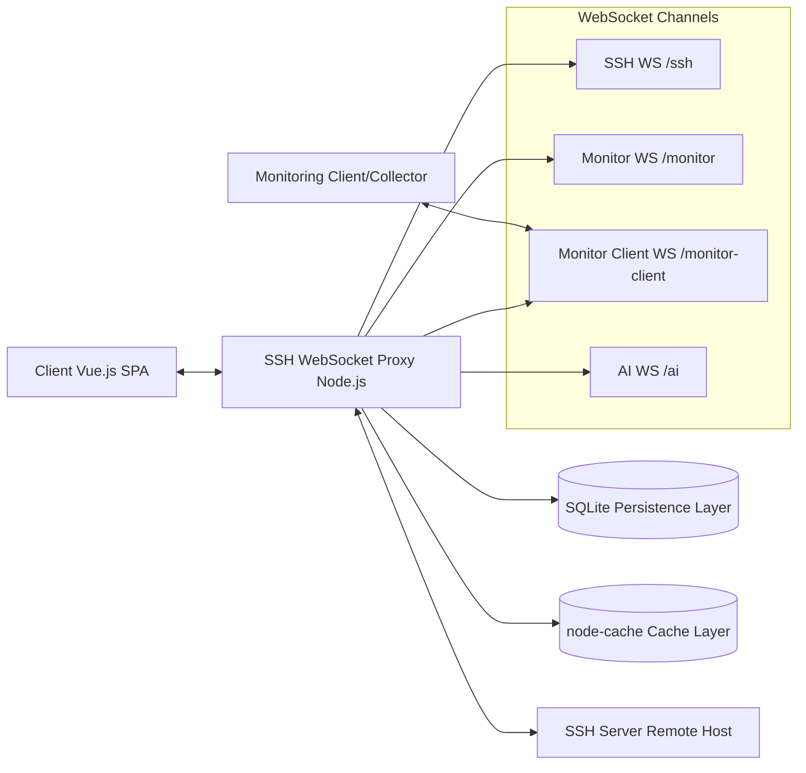

# EasySSH

<div align="center">
  
  <h3>Modern Web Terminal · Efficient Server Management · Secure Remote Access</h3>
  
  <p>
    <a href="#live-demo">Live Demo</a> •
    <a href="#core-features">Core Features</a> •
    <a href="#quick-start">Quick Start</a> •
    <a href="#technical-implementation">Technical Implementation</a> •
    <a href="#deployment-guide">Deployment Guide</a> •
    <a href="#future-roadmap">Future Roadmap</a>
  </p>
  
  <p>
    
    
    
  </p>

  <p>
    <strong>🌐 Multi-language Support</strong><br/>
    <a href="../zh/README.md">🇨🇳 中文</a> | 
    <a href="../README.md">📚 Documentation Center</a>
  </p>
</div>

## Product Introduction

**EasySSH** is a powerful web-based SSH terminal client that provides developers, system administrators, and DevOps teams with an efficient, secure, and user-friendly remote server management experience. No additional software installation required - just a browser to manage all your servers anytime, anywhere.

## Live Demo

- [EasySSH Online Experience](https://easyssh.example.com)
- Demo Account: `demo@example.com` / Password: `admin`

<div align="center">
  
</div>

## Core Features

<table>
  <tr>
    <td>🌐 <b>Browser SSH Terminal</b></td>
    <td>Access remote servers through any modern browser without installing additional software</td>
  </tr>
  <tr>
    <td>⚡ <b>High-Performance Architecture</b></td>
    <td>WebSocket real-time communication ensures rapid command response, supporting thousands of concurrent connections</td>
  </tr>
  <tr>
    <td>🔐 <b>Secure Credential Management</b></td>
    <td>All server credentials stored with military-grade AES-256 encryption for data security</td>
  </tr>
  <tr>
    <td>🔄 <b>Session Persistence</b></td>
    <td>Supports disconnection recovery and session restoration for work continuity</td>
  </tr>
  <tr>
    <td>📱 <b>Responsive Design</b></td>
    <td>Perfect adaptation from mobile phones to large displays across all screen sizes</td>
  </tr>
  <tr>
    <td>🎨 <b>Multi-Theme Support</b></td>
    <td>Rich terminal theme selection including dark mode and eye-care mode</td>
  </tr>
  <tr>
    <td>📑 <b>Multi-Tab Management</b></td>
    <td>Parallel connection and management of multiple servers in a single interface</td>
  </tr>
  <tr>
    <td>🚀 <b>Hybrid Storage Engine</b></td>
    <td>SQLite + node-cache hybrid storage architecture balancing performance and reliability</td>
  </tr>
</table>

## Use Cases

- **Development Teams**: Collaborative management of development, testing, and production servers
- **System Administrators**: Centralized monitoring and management of numerous servers
- **DevOps Engineers**: Rapid deployment and maintenance operations in CI/CD workflows
- **Remote Work**: Secure access to work environments anytime, anywhere
- **Educational Institutions**: Unified Linux learning environment for students

## Quick Start

### 🐳 Docker Quick Start (Recommended)

```bash
# Docker quick start
docker run -d \
  --name easyssh \
  --restart unless-stopped \
  -p 8520:8520 \
  -v easyssh-data:/app/server/data \
  -v easyssh-logs:/app/server/logs \
  shanheee/easyssh:latest
```
> **Access**: After deployment, access EasySSH interface directly via `http://<server-ip>:8520`.

### 💻 Local Development Installation

```bash
# Clone repository
git clone https://github.com/shan-hee/easyssh.git
cd easyssh

# Install dependencies
npm install

# Configure environment
cp .env.example .env
# Edit .env file to set necessary parameters

# Start development server
npm run dev
```

### Usage

1. Visit http://localhost:8520
2. First use: if no admin exists, the login page will guide you to "Log in and create admin account"; otherwise, just log in
3. Add your first server
4. Click connect button and start remote management!

## Technical Implementation

### System Architecture



### Technology Stack

<table>
  <tr>
    <th>Frontend</th>
    <th>Backend</th>
    <th>Data Storage</th>
  </tr>
  <tr>
    <td>
      • Vue.js 3<br/>
      • Pinia<br/>
      • Xterm.js<br/>
      • Element Plus<br/>
      • Vite
    </td>
    <td>
      • Node.js<br/>
      • Express<br/>
      • WebSocket<br/>
      • JWT Authentication<br/>
      • SSH2
    </td>
    <td>
      • SQLite<br/>
      • node-cache<br/>
      • bcrypt<br/>
      • crypto-js
    </td>
  </tr>
</table>

### Performance Advantages

- **Real-time Communication**: WebSocket establishes persistent connections ensuring rapid command execution response
- **High-speed Caching**: node-cache reduces database queries by over 70%, decreasing average API response time by 150ms
- **Security Assurance**: All sensitive data encrypted with AES-256, passwords stored with bcrypt hashing
- **Scalability**: Distributed architecture design supporting horizontal scaling

## Deployment Guide

### 🐳 Docker Compose Deployment (Recommended)

Recommended for production environment deployment, easy to manage and upgrade:

```bash
# Create deployment directory
mkdir easyssh && cd easyssh

# Download docker-compose.yml
wget https://raw.githubusercontent.com/shanheee/easyssh/main/docker-compose.yml

# Configure environment variables (optional)
# Create .env file to set JWT_SECRET and ENCRYPTION_KEY

# Start all services
docker compose up -d

# Check service status
docker compose ps

# View logs
docker compose logs -f
```

#### Version Upgrade

```bash
# Enter deployment directory
cd easyssh

# Pull latest image
docker compose pull

# Restart services
docker compose up -d
```

### Traditional Deployment

```bash
# Frontend build
npm run build
# Deploy dist directory to web server

# Backend deployment
cd server
npm install --production
pm2 start index.js --name easyssh-server
```

### Cloud Platform Deployment

EasySSH supports one-click deployment to mainstream cloud platforms:

- [Deploy to Vercel](https://vercel.com/import/project?template=https://github.com/shan-hee/easyssh)
- [Deploy to Heroku](https://heroku.com/deploy?template=https://github.com/shan-hee/easyssh)

## Future Roadmap

<table>
  <tr>
    <td>📂 <b>File Manager</b></td>
    <td>Integrated SFTP functionality providing intuitive file upload, download, and management</td>
  </tr>
  <tr>
    <td>👥 <b>Team Collaboration</b></td>
    <td>Multi-user permission management and real-time collaboration capabilities</td>
  </tr>
  <tr>
    <td>📹 <b>Session Recording</b></td>
    <td>Record and replay terminal sessions for auditing and training purposes</td>
  </tr>
  <tr>
    <td>🔑 <b>WebAuthn Support</b></td>
    <td>Hardware security key integration for passwordless authentication</td>
  </tr>
  <tr>
    <td>📱 <b>Mobile Applications</b></td>
    <td>Native iOS and Android clients</td>
  </tr>
  <tr>
    <td>🔌 <b>Protocol Extensions</b></td>
    <td>Support for additional protocols like Telnet, RDP, and VNC</td>
  </tr>
</table>

## Community & Support

- [User Documentation](https://docs.easyssh.example.com)
- [Issue Reporting](https://github.com/shan-hee/easyssh/issues)

## Contributing

We welcome code contributions, issue reports, and suggestions! Please check [CONTRIBUTING.md](CONTRIBUTING.md) to learn how to participate in the project.

## License

This project is open-sourced under the [Apache License 2.0](../../LICENSE).

---

<div align="center">
  <strong>EasySSH</strong> - Making remote server management simple and efficient
  <br/>
  Built with ❤️
</div>
